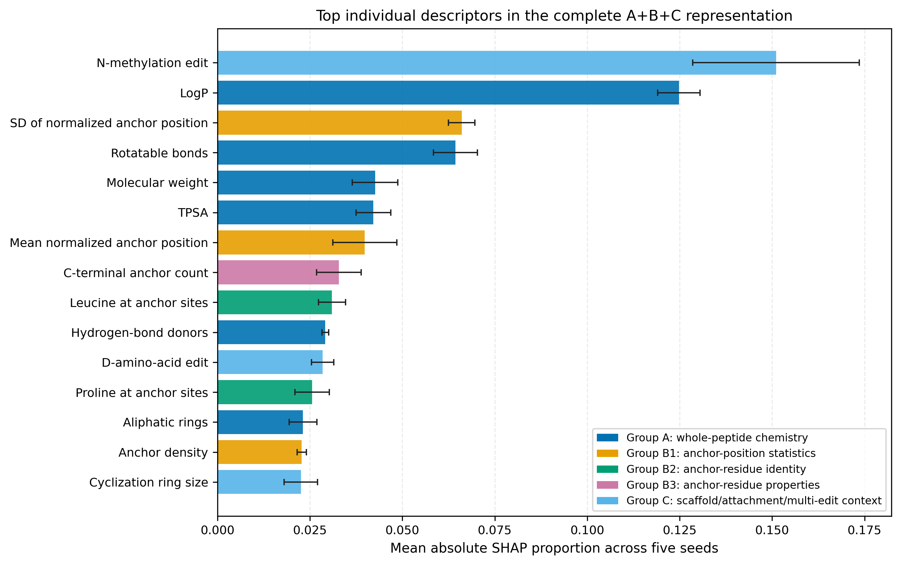

<div align="center">


# CASPer

> Reproducible benchmarking for **Site-Conditioned Edit Chemistry for Cyclic
> Peptide Permeability Modeling**

CASPer packages the verified 7,224-sample dataset, fixed evaluation splits,
production analysis code, frozen results, and publication-ready figures in one
reproducible repository.

## At a glance

| Analysis | Status | Coverage |
|---|:---:|---:|
| Primary descriptor ablation | ✅ Complete | 70 / 70 runs |
| Estimator × descriptor matrix | ✅ Complete | 175 / 175 runs |
| SHAP interpretation | ✅ Complete | 5 seeds |
| Time-forward diagnostics | ✅ Complete | 8 cutoffs |
| Scaffold-focused ranking | ✅ Complete | 49 families |
| Test suite | ✅ Passing | 28 / 28 tests |

## Key result visualization



*Top individual descriptors in the complete A+B+C representation. Bars show
mean absolute SHAP proportions across five independently fitted seeds; error
bars indicate two-sided 95% t-confidence intervals. The legend definition is
**Group C: scaffold/attachment/multi-edit context**.*

## Repository map

| Path | Contents |
|---|---|
| `data/` | Corrected dataset and fixed random/sequence-cluster splits |
| `src/` | Featurization, data, evaluation, and benchmark code |
| `configs/benchmark/` | Final 50-trial primary benchmark protocol |
| `scripts/` | Experiments, statistics, SHAP, freezing, and figure generation |
| `tests/` | Regression and pipeline validation tests |
| `results/final_experiments/` | Frozen runs, predictions, statistics, and diagnostics |
| `results/final_experiments/summary_tables/` | Publication-facing result tables |
| `results/final_experiments/figures/` | PNG/PDF figures and plotted source data |

## Reproduce the outputs

Use the project virtual environment from the repository root:

```bash
# Regenerate SHAP tables, including seed-level feature attributions and 95% CIs
.venv/bin/python scripts/run_shap.py

# Regenerate all publication figures and their checksummed manifest
.venv/bin/python scripts/generate_figures.py
```

The canonical machine-readable result freeze is
[`FINAL_RESULTS_FREEZE.json`](results/final_experiments/FINAL_RESULTS_FREEZE.json).

## Validate the repository

```bash
python scripts/generate_figures.py
```

## License

See [`LICENSE`](LICENSE).
