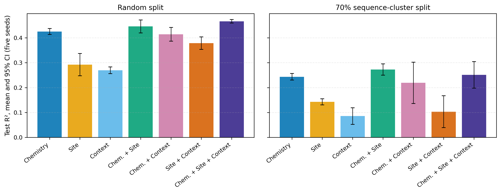

<div align="center">


# CASPer

### Site-Conditioned Edit Chemistry for Cyclic Peptide Permeability Modeling

An uncertainty-aware, reproducible benchmark for separating **whole-peptide chemistry**,  
**site-indexed information**, and **scaffold context** in cyclic-peptide permeability models.

[](https://www.python.org/)
[](LICENSE)
[](results/final_experiments/FINAL_RESULTS_FREEZE.json)
[](tests/)

[Overview](#overview) · [Results](#key-findings) · [Quick start](#quick-start) · [Reproduction](#reproducing-the-analysis) · [Paper](#paper-and-review-materials)

</div>

---

## Overview

CASPer accompanies the manuscript **“Site-Conditioned Edit Chemistry for Cyclic Peptide Permeability Modeling.”** The repository contains the corrected 7,224-sample dataset, fixed evaluation splits, model and descriptor implementations, statistical analyses, frozen benchmark outputs, publication figures, and validation tests needed to audit the study.

The central benchmark separates three sources of information:

| Group | Representation          | What it captures                                             |
| :---: | ----------------------- | ------------------------------------------------------------ |
| **A** | Whole-peptide chemistry | Eight selected molecular descriptors plus edit-count summaries |
| **B** | Site information        | Explicit site-indexed anchor descriptors and local residue identity |
| **C** | Context                 | Sequence/scaffold context surrounding the edited peptide     |

All seven combinations—A, B, C, A+B, A+C, B+C, and A+B+C—are evaluated under matched protocols. Additional analyses compare estimator families, SHAP attribution, time-forward generalization, and within-family scaffold ranking.

<p align="center">
  
</p>


## Key findings

- **A+B+C** has the highest random-split point estimate, while **A+B** has the highest sequence-cluster point estimate.
- The cluster-split differences among the leading representations are **not significant after Holm multiplicity correction**.
- In the complete model, mean absolute SHAP attribution is distributed across Chemistry (**35.6%**), Site (**37.1%**), and Context (**27.3%**).
- Random Forest and XGBoost are effectively tied for A+B+C; the paired R² difference is **0.001** with a 95% CI of **[−0.009, 0.012]**.
- Time-forward performance is weak and variable. ECFP is strongest on average, but performance changes partly track the chemical-similarity shift around 2021.
- Across scaffold families, adding Site to Chemistry does not provide a systematic ranking advantage: mean difference **−0.017**, bootstrap 95% CI **[−0.043, 0.009]**.

> [!NOTE]
> Point estimates should be interpreted together with their confidence intervals and multiplicity-adjusted comparisons. Full-precision values are retained in the machine-readable result tables.

## Benchmark status

| Analysis                      |                    Completion |
| ----------------------------- | ----------------------------: |
| Primary descriptor ablation   |   **70 / 70** seed-level runs |
| Estimator × descriptor matrix | **175 / 175** seed-level runs |
| SHAP attribution              |               **5 / 5** seeds |
| Time-forward diagnostics      |             **8 / 8** cutoffs |
| Scaffold ranking              |       **49** peptide families |
| Test suite                    |       **28 passed, 0 failed** |

The canonical result manifest is [`FINAL_RESULTS_FREEZE.json`](results/final_experiments/FINAL_RESULTS_FREEZE.json). It records completion status, dataset and split checksums, artifact checksums, environment details, and the final paired comparisons.

## Quick start

### 1. Create an environment

```bash
git clone https://github.com/leochenminrui/CASPer.git
cd CASPer

python3 -m venv .venv
source .venv/bin/activate
python -m pip install --upgrade pip
python -m pip install -r requirements.txt
```

The project requires Python 3.8 or newer. Core dependencies include RDKit, scikit-learn, XGBoost, Optuna, SHAP, pandas, SciPy, and PyArrow.

### 2. Validate the checkout

```bash
python -m pytest -q
python -m py_compile scripts/*.py
```

### 3. Regenerate every publication figure

```bash
python scripts/generate_figures.py
```

PNG and vector PDF figures are written to [`results/final_experiments/figures/`](results/final_experiments/figures/). Plot-ready source tables are written to its `source_data/` subdirectory.

## Reproducing the analysis

The repository ships the completed raw runs and frozen summaries, so figures and statistical tables can be regenerated without retraining every model. Model fitting is substantially more computationally expensive than validation or plotting.

| Stage                       | Entry point                                   | Output                                                       |
| --------------------------- | --------------------------------------------- | ------------------------------------------------------------ |
| Primary ablation completion | `scripts/run_missing_primary.py`              | `raw_runs/primary_ablation/`                                 |
| Estimator matrix            | `scripts/run_estimator_comparison.py`         | `raw_runs/estimator_matrix/`                                 |
| Missing estimator cells     | `scripts/run_missing_estimator_matrix.py`     | `raw_runs/estimator_matrix/`                                 |
| Primary statistics and CIs  | `scripts/compute_final_statistics.py`         | `primary_ablation/`, `estimator_matrix/`, `paired_statistics/` |
| Grouped paired bootstrap    | `scripts/compute_grouped_paired_bootstrap.py` | `paired_statistics/`                                         |
| Five-seed SHAP              | `scripts/run_shap.py`                         | `shap/`                                                      |
| Time-forward analysis       | `scripts/run_time_forward.py`                 | `time_forward/`                                              |
| Time-forward summaries      | `scripts/finalize_time_forward_statistics.py` | `time_forward/`                                              |
| Scaffold-family ranking     | `scripts/run_scaffold_ranking.py`             | `scaffold_ranking/`                                          |
| Scaffold statistics         | `scripts/finalize_scaffold_statistics.py`     | `scaffold_ranking/`                                          |
| Result freeze               | `scripts/freeze_results.py`                   | `FINAL_RESULTS_FREEZE.json`                                  |
| Publication figures         | `scripts/generate_figures.py`                 | `figures/`                                                   |

The matched primary protocol is defined in [`configs/benchmark/primary_ablation.yaml`](configs/benchmark/primary_ablation.yaml): two evaluation splits, five seeds, and 50 Optuna trials per primary cell.

## Repository structure

```text
CASPer/
├── configs/benchmark/              # Frozen benchmark protocol
├── data/
│   ├── raw/                        # Source CycPeptMPDB tables
│   ├── processed/pem_schema/       # Corrected 7,224-sample dataset
│   └── splits/CycPeptMPDB_PAMPA/   # Fixed random and cluster splits
├── src/
│   ├── baselines/                  # Baseline representations
│   ├── benchmark/                  # Featurizers, tuning, and evaluation
│   └── data/                       # Parsing, auditing, schemas, and splitting
├── scripts/                        # Experiment, statistics, freeze, and plots
├── tests/                          # Pipeline and split validation
├── results/final_experiments/      # Frozen runs, tables, CIs, and figures
├── output/pdf/                     # Submission-ready manuscript and response
└── Site_Conditioned_..._revised/   # LaTeX manuscript source
```

## Result guide

| Need                                 | Recommended artifact                                         |
| ------------------------------------ | ------------------------------------------------------------ |
| Verify the frozen study state        | [`FINAL_RESULTS_FREEZE.json`](results/final_experiments/FINAL_RESULTS_FREEZE.json) |
| Read publication-rounded results     | [`main_tables_publication_rounded.csv`](results/final_experiments/summary_tables/main_tables_publication_rounded.csv) |
| Audit full-precision results         | [`main_tables_full_precision.csv`](results/final_experiments/summary_tables/main_tables_full_precision.csv) |
| Inspect primary confidence intervals | [`summary_with_ci.csv`](results/final_experiments/primary_ablation/summary_with_ci.csv) |
| Inspect paired tests                 | [`paired_tests.csv`](results/final_experiments/paired_statistics/paired_tests.csv) |
| Inspect grouped-bootstrap intervals  | [`bootstrap_differences.csv`](results/final_experiments/paired_statistics/bootstrap_differences.csv) |
| Trace generated figures              | [`figure_manifest.csv`](results/final_experiments/figures/figure_manifest.csv) |

## Paper and review materials

- [Revised manuscript PDF](output/pdf/Site_Conditioned_Edit_Chemistry_for_Cyclic_Peptide_Permeability_Modeling_revised.pdf)
- [Point-by-point response to reviewers](output/pdf/Response_to_Reviewers.pdf)
- [LaTeX manuscript source](Site_Conditioned_Edit_Chemistry_for_Cyclic_Peptide_Permeability_Modeling__revised/sn-article.tex)
- [Editable reviewer response](Site_Conditioned_Edit_Chemistry_for_Cyclic_Peptide_Permeability_Modeling__revised/Response_to_Reviewers.md)

## Reproducibility notes

- Random and sequence-cluster splits are fixed and distributed with the repository.
- Primary estimates use five seeds and Student-*t* confidence intervals across seeds.
- Paired model comparisons use exact two-sided sign-flip tests with Holm correction.
- Grouped bootstrap procedures resample unique peptide sequences, sequence clusters, or peptide families as appropriate.
- Dataset, split, and final-artifact checksums are stored in the frozen manifest.

## License

The software in this repository is released under the [MIT License](LICENSE). Source datasets remain subject to the terms of their original providers.

---

<div align="center">
**CASPer** · Reproducible cyclic-peptide permeability modeling

</div>
